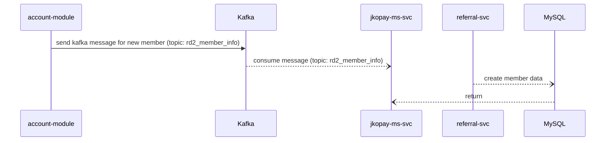
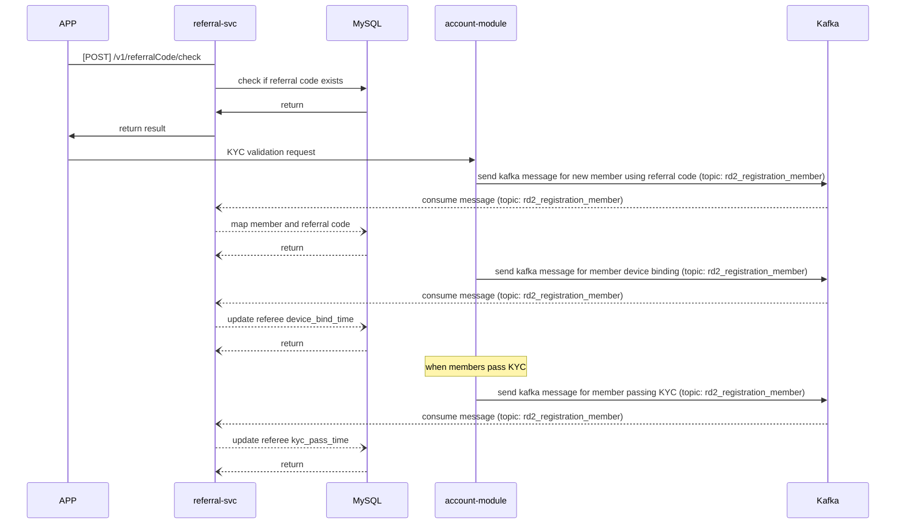
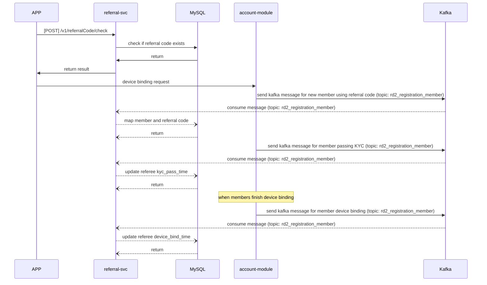
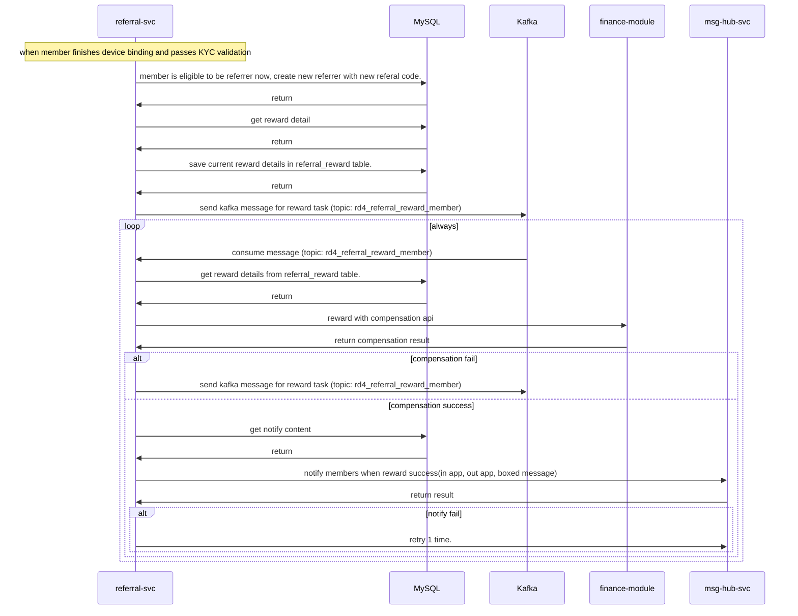
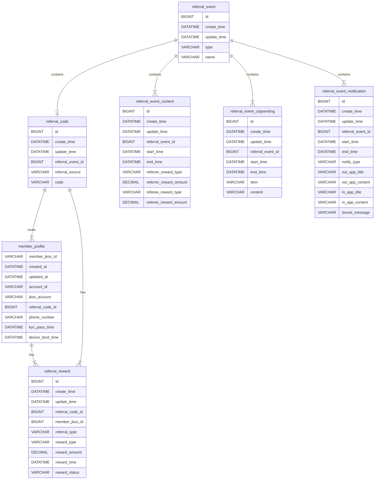
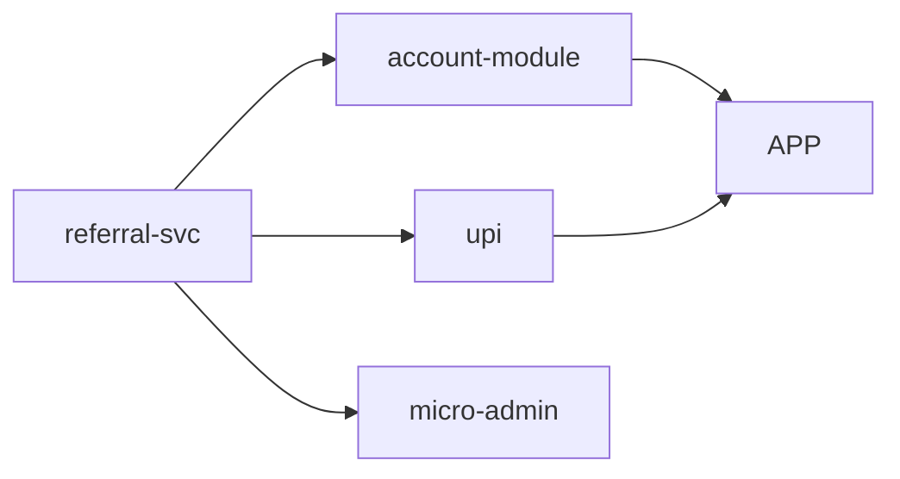

# 1. Abstract

## 1.1 PRD link
[PRD link](https://jkopay.atlassian.net/wiki/spaces/PM/pages/29687846)

## 1.2 Naming

1. 事件(event)：把每個活動定義為一個事件，區分個人推薦與活動推薦
2. 文案(copywriting)：每一個事件都有各自的文案，由後端提供，存DB
3. 推薦碼(referral code)：註冊時使用的代碼，註冊成功時依照回饋內容給予回饋
4. 註冊成功(success)：kyc與裝置綁定都通過定義為註冊成功
5. 註冊碼/邀請碼/推薦碼/推薦序號 -> 統一依照 PRD 稱為註冊碼

# 2. System Architecture

## 2.1 Information Flow

### 2.1.1 Sync New Member

init: DBA helps to dump data from account module db as initail data

runtime:



### 2.1.2 KYC Validation (for common user)


### 2.1.3 Device Vinding (for SHOPEE user)


### 2.1.4 Reward Eligible Members


## 2.2 System Architecture Graph
整理系統架構圖，將模組間的交互關係視覺化

# 3. Implementation

## 3.1 Communication Interface

### 3.1.1 Mobile API Reference
[Reference Link](https://jkopay.atlassian.net/wiki/spaces/RD4/pages/34668778/Referral+Code+Mobile+API+Reference)

### 3.1.2 Internal API Reference
[Reference Link](https://jkopay.atlassian.net/wiki/spaces/RD4/pages/34701479/Referral+Code+Internal+API+Reference)

### 3.1.3 Kafka Reference
[Reference Link](https://jkopay.atlassian.net/wiki/spaces/RD4/pages/36569146)

## 3.2 Database Design

## 3.2.1 Entity Relationship Diagram


## 3.2.2 Table Schema

### 3.2.2.1 referral_event:
Define events for requirement(1.) to seperate personal user and other referral code source, simply give it a `type` and a `name`.

| column      | Type     | length | nullable | Description                           |
|-------------|----------|--------|----------|---------------------------------------|
| id          | BIGINT   | -      | false    | PK id                                 |
| create_time | DATATIME | -      | false    | create time                           |
| update_time | DATATIME | -      | true     | update time                           |
| type        | VARCHAR  | 20     | true     | event type, [enum:PERSONAL, CAMPAIGN] |
| name        | VARCHAR  | 20     | true     | event name                            |

### 3.2.2.2 referral_code:
Referral code, each eligible referrer will hava a referral code and relative to `referral_event` with `referral_event_id`, use referral_source to save the referrer's reference. (in personal case, it's jkosId)

| column            | Type     | length | nullable | Description                |
|-------------------|----------|--------|----------|----------------------------|
| id                | BIGINT   | -      | false    | PK id                      |
| create_time       | DATATIME | -      | false    | create time                |
| update_time       | DATATIME | -      | true     | update time                |
| referral_event_id | BIGINT   | -      | false    | relative to referral_event |
| referral_source   | VARCHAR  | 128    | false    | in personal case, jkosid   |
| code              | VARCHAR  | 10     | false    | referral code              |

### 3.2.2.3 referral_event_content:
Reward content, relative to `referral_event` with `referral_event_id`, give it `start_time` and `end_time` for each event and period, reward can be JKO coin or JKO coupon so give it `XXX_reward_type` and `XXX_reward_amount` to seperate them.

| column                 | Type          | length | nullable | Description                              |
|------------------------|---------------|--------|----------|------------------------------------------|
| id                     | BIGINT        | -      | false    | PK id                                    |
| create_time            | DATATIME      | -      | false    | create time                              |
| update_time            | DATATIME      | -      | true     | update time                              |
| referral_event_id      | BIGINT        | -      | false    | relative to referral_event               |
| start_time             | DATATIME      | -      | false    | start time                               |
| end_time               | DATATIME      | -      | false    | end time                                 |
| referrer_reward_type   | VARCHAR       | 10     | false    | referrer reward type, [ENUM:COIN,COUPON] |
| referrer_reward_amount | DECIMAL(10,2) | -      | false    | referrer reward amount                   |
| referee_reward_type    | VARCHAR       | 10     | false    | referee reward type, [ENUM:COIN,COUPON]  |
| referee_reward_amount  | DECIMAL(10,2) | -      | false    | referee reward amount                    |

### 3.2.2.4 referral_event_copywriting:
Copywriting, relative to `referral_event` with `referral_event_id`, give it `start_time` and `end_time` for each event and period, save copywriting content  in `content` and seperate multiple items in different usage with `item`.

| column            | Type     | length | nullable | Description                                                                                        |
|-------------------|----------|--------|----------|----------------------------------------------------------------------------------------------------|
| id                | BIGINT   | -      | false    | PK id                                                                                              |
| create_time       | DATATIME | -      | false    | create time                                                                                        |
| update_time       | DATATIME | -      | true     | update time                                                                                        |
| referral_event_id | BIGINT   | -      | false    | relative to referral_event                                                                         |
| start_time        | DATATIME | -      | false    | start time                                                                                         |
| end_time          | DATATIME | -      | false    | end time                                                                                           |
| item              | VARCHAR  | 20     | false    | item, [ENUM:SUBTITLE,SHARE_MESSAGE,KYC_VALIDATION,&#10;EVENT_DETAIL,INVITE_STEPS,REMINDER_MESSAGE] |
| content           | VARCHAR  | 2048   | false    | copywriting content, json string format                                                            |

### 3.2.2.5 referral_event_notification:
Notification message,  relative to `referral_event` with `referral_event_id`, give it `start_time` and `end_time` for each event and period, reward target can be referrer or referee so give it `notify_type` to seperate them.

| column            | Type     | length | nullable | Description                          |
|-------------------|----------|--------|----------|--------------------------------------|
| id                | BIGINT   | -      | false    | PK id                                |
| create_time       | DATATIME | -      | false    | create time                          |
| update_time       | DATATIME | -      | true     | update time                          |
| referral_event_id | BIGINT   | -      | false    | relative to referral_event           |
| start_time        | DATATIME | -      | false    | start time                           |
| end_time          | DATATIME | -      | false    | end time                             |
| notify_type       | VARCHAR  | 10     | false    | notify type, [ENUM:REFERRER,REFEREE] |
| out_app_title     | VARCHAR  | 100    | false    | out app title                        |
| out_app_content   | VARCHAR  | 2048   | false    | out app content                      |
| in_app_title      | VARCHAR  | 100    | false    | in app title                         |
| in_app_content    | VARCHAR  | 2048   | false    | in app content                       |
| boxed_message     | VARCHAR  | 2048   | false    | boxed message                        |

### 3.2.2.6 member_profile:
Referee and member detail, relative to `referral_code` with `referrer_code_id`,  save `jkos_Id` to define user reference in account modules, use `phone_number` to save phone number user used when registration, save user passing KYC and device binding timings seperately in `kyc_pass_time` and `device_bind_time`.

| column           | Type     | length | nullable | Description                                       |
|------------------|----------|--------|----------|---------------------------------------------------|
| account_id       | VARCHAR  | 20     | false    | referee's account_id PK                           |
| created_at       | DATATIME | -      | false    | create time                                       |
| updated_at       | DATATIME | -      | false    | update time                                       |
| member_jkos_id   | VARCHAR  | 36     | false    | member's jkosId,                                  |
| jkos_account     | VARCHAR  | 9      | false    | referee's jkos_account                            |
| referral_code_id | BIGINT   | -      | false    | referee's relative to referral_code  (new cloumn) |
| phone_number     | VARCHAR  | 10     | false    | referee's phone number               (new cloumn) |
| kyc_pass_time    | DATATIME | -      | false    | referee passes kyc time              (new cloumn) |
| device_bind_time | DATATIME | -      | false    | referee finishes device binding time (new cloumn) |

### 3.2.2.7 referral_reward:
Referral relationship for referrer and referee, relative to `referrer` with `referrer_id`, relative to `referee` with `referee_id`, reward target can be referrer or referee so give it `referral_type` to seperate them, reward can be JKO coin or JKO coupon so give it `reward_type` and `reward_amount` to seperate them, record reward timing with `reward_time` and record result with `reward_status` for retrying.

| column            | Type          | length | nullable | Description                                |
|-------------------|---------------|--------|----------|--------------------------------------------|
| id                | BIGINT        | -      | false    | PK id                                      |
| create_time       | DATATIME      | -      | false    | create time                                |
| update_time       | DATATIME      | -      | true     | update time                                |
| referral_code_id  | BIGINT        | -      | false    | relative to referral_code                  |
| member_account_id | VARCHAR       | -      | false    | relative to member_profile                 |
| referral_type     | VARCHAR       | 10     | false    | reward to, [ENUM:REFERRER,REFEREE]         |
| reward_type       | VARCHAR       | 10     | false    | reward type, [ENUM:COIN,COUPON]            |
| reward_amount     | DECIMAL(10,2) | -      | false    | reward amount                              |
| reward_time       | DATATIME      | -      | false    | reward execution time                      |
| reward_status     | VARCHAR       | 10     | false    | reward status, [ENUM:PENDING,SUCCESS,FAIL] |

## 3.2.3 SQL

### 3.2.3.1 check if referral code is valid

```
SELECT
    count(*)
FROM referral_event_content content
LEFT JOIN referral_code
ON content.referral_event_id = referral_code.referral_event_id
WHERE
    content.start_time <= ?currentTime
    AND content.end_time > ?currentTime
    AND referral_code.code = ?code
```

### 3.2.3.2 get referral subtitle
```
SELECT
    content
FROM referral_event
LEFT JOIN referral_event_copywriting
ON referral_event.id = referral_event_copywriting.referral_event_id
WHERE
    referral_event.type = 'PERSONAL'
    AND referral_event_copywriting.item = 'SUBTITLE'
```

### 3.2.3.3 get referral event detail
```
SELECT
    item,
    content
FROM referral_event
LEFT JOIN referral_event_copywriting copywriting
ON referral_event.id = copywriting.referral_event_id
WHERE
    copywriting.start_time <= ?currentTime
    AND copywriting.end_time > ?currentTime
    AND referral_event.type = 'PERSONAL'
    AND copywriting.item IN (
        'SHARE_MESSAGE','KYC_VALIDATION','EVENT_DETAIL','INVITE_STEPS')
```

```
SELECT
    content.start_time,
    content.end_time
FROM referral_event
LEFT JOIN referral_event_content content
ON referral_event.id = content.referral_event_id
WHERE
    content.start_time <= ?currentTime
    AND content.end_time > ?currentTime
    AND referral_event.type = 'PERSONAL'
```

### 3.2.3.4 get referral statistics
```
SELECT
    content
FROM referral_event
LEFT JOIN referral_event_copywriting copywriting
ON referral_event.id = copywriting.referral_event_id
WHERE
    copywriting.start_time <= ?currentTime
    AND copywriting.end_time > ?currentTime
    AND referral_event.type = 'PERSONAL'
    AND copywriting.item = 'REMINDER_MESSAGE'
```

```
SELECT
    member.jkos_id,
    member.phone_number,
    member.kyc_pass_time,
    member.device_bind_time,
    referral_reward.reward_type,
    referral_reward.reward_amount
FROM referral_code
LEFT JOIN member_profile member
ON referral_code.id = member.referral_code_id
LEFT JOIN referral_reward
ON referral_code.id = referral_reward.referral_code_id
WHERE
    referral_code.referral_source = ?userJkosId
    AND referral_reward.referral_type = 'REFERRER'
```

### 3.2.3.5 get referral overview
```
SELECT
    referral_code.id,
    referral_code.code
FROM referral_event
LEFT JOIN referral_code
ON referral_event.id = referral_code.referral_event_id
WHERE
    referral_code.referral_source = ?userJkosId
    AND referral_event.type = 'PERSONAL'
```

```
SELECT
    member.kyc_pass_time,
    member.device_bind_time,
    referral_reward.reward_type,
    referral_reward.reward_amount
FROM member_profile member
LEFT JOIN referral_reward
ON member.referral_code_id = referral_reward.referral_code_id
WHERE
    member.referral_code_id = ?referralCodeId
    AND referral_reward.referral_type = 'REFERRER'
```

### 3.2.3.6 get referral statistics
```
SELECT
    member.member_jkos_id,
    member.phone_number,
    member.kyc_pass_time,
    member.device_bind_time,
    referral_reward.referral_type,
    referral_reward.reward_type,
    referral_reward.reward_amount,
    referral_reward.reward_time,
    referral_reward,reward_status
FROM member_profile member
LEFT JOIN referral_reward
ON member.referral_code_id = referral_reward.referral_code_id
WHERE
    member.referral_code_id = ?referralCodeId
```

## 3.3 Monitor

### 3.3.1 Log and count kafka message per minute in kibana

### 3.3.2 Alert for kafka messages are too many in single topic (100,000/5min)

# 4. Project Management

## 4.1 Tasks

| Team | service        | Task                                                                   | Assignee | Estimated time                    | Start Date |
|------|----------------|------------------------------------------------------------------------|----------|-----------------------------------|------------|
| RD2  | account-module | kyc validation with referral code                                      |          |                                   |            |
| RD2  | account-module | device binding with referral code                                      |          |                                   |            |
| RD2  | account-module | send kafka when using referral code                                    |          |                                   |            |
| RD2  | account-module | send kafka when passes kyc validation (with phone and referral code)   |          |                                   |            |
| RD2  | account-module | send kafka when finishes device binding (with phone and referral code) |          |                                   |            |
| RD2  | upi            | request subtitle in /myTop                                             |          |                                   |            |
| RD4  | referral-svc   | DB component                                                           | Randall  | 8h                                |            |
| RD4  | referral-svc   | implement REST clients                                                 | Randall  | 8h                                |            |
| RD4  | referral-svc   | consumers for Kafka                                                    | Randall  | 8h                                |            |
| RD4  | referral-svc   | service component for business logic                                   | Randall  | 8h                                |            |
| RD4  | referral-svc   | implement WEB API                                                      | Randall  | 8h                                |            |
| RD4  | referral-svc   | implement APP API                                                      | Randall  | 8h                                |            |
| WEB  | micro-admin    | get referral overview                                                  | Jill     | 1w (with get referral statistics) |            |
| WEB  | micro-admin    | get referral statistics                                                | Jill     | -                                 |            |
| APP  | -              | kyc validation page + device binding page                              | Water    | 5d                                |            |
| APP  | -              | referral code main page                                                | Water    | 7d                                |            |
| APP  | -              | myTop page                                                             | Water    | 2d                                |            |
| APP  | -              | router                                                                 | Water    | 1d                                |            |

## 4.2 Dependencies

