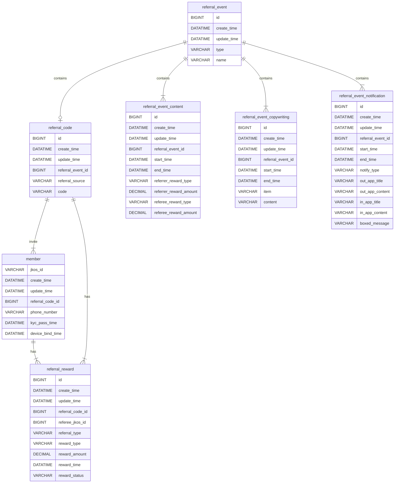

# DB schema

## Requirement:
1. Be extendable for campaigns, not just for friend referral codes.
2. Provide periods with different reward conditions.
3. Save copywriting as json template format.
4. Save reward content for each period separately.
5. Save notifications messages.
6. Notifications messages are different for referrer and referee.
7. Copywritings and notifications messages should be dynamic by time period.
8. For endpoint users, it doesn't matter where referral codes are from, so referral codes should be easy to search for.
9. Referee must be a personal account, so it should be able to relate to a JKO user.
10. Save KYC passed time and device binding time for reward conditions. (reward once both success)
11. Save reward content when rewarding, so it won't be effected by the reward period  when retrying.

## Entity Relationship Diagrams


### referral_event:
Define events for requirement(1.) to seperate personal user and other referral code source, simply give it a `type` and a `name`.

| column      | Type     | length | nullable | Description                           |
|-------------|----------|--------|----------|---------------------------------------|
| id          | BIGINT   | -      | false    | PK id                                 |
| create_time | DATATIME | -      | false    | create time                           |
| update_time | DATATIME | -      | true     | update time                           |
| type        | VARCHAR  | 20     | true     | event type, [enum:PERSONAL, CAMPAIGN] |
| name        | VARCHAR  | 20     | true     | event name                            |

### referral_code:
Referral code, each eligible referrer will hava a referral code and relative to `referral_event` with `referral_event_id`, use referral_source to save the referrer's reference. (in personal case, it's jkosId)

| column            | Type     | length | nullable | Description                |
|-------------------|----------|--------|----------|----------------------------|
| id                | BIGINT   | -      | false    | PK id                      |
| create_time       | DATATIME | -      | false    | create time                |
| update_time       | DATATIME | -      | true     | update time                |
| referral_event_id | BIGINT   | -      | false    | relative to referral_event |
| referral_source   | VARCHAR  | 128    | false    | in personal case, jkosid   |
| code              | VARCHAR  | 10     | false    | referral code              |

### referral_event_content:
Reward content, relative to `referral_event` with `referral_event_id`, give it `start_time` and `end_time` for each event and period, reward can be JKO coin or JKO coupon so give it `XXX_reward_type` and `XXX_reward_amount` to seperate them.

| column                 | Type          | length | nullable | Description                              |
|------------------------|---------------|--------|----------|------------------------------------------|
| id                     | BIGINT        | -      | false    | PK id                                    |
| create_time            | DATATIME      | -      | false    | create time                              |
| update_time            | DATATIME      | -      | true     | update time                              |
| referral_event_id      | BIGINT        | -      | false    | relative to referral_event               |
| start_time             | DATATIME      | -      | false    | start time                               |
| end_time               | DATATIME      | -      | false    | end time                                 |
| referrer_reward_type   | VARCHAR       | 10     | false    | referrer reward type, [ENUM:COIN,COUPON] |
| referrer_reward_amount | DECIMAL(10,2) | -      | false    | referrer reward amount                   |
| referee_reward_type    | VARCHAR       | 10     | false    | referee reward type, [ENUM:COIN,COUPON]  |
| referee_reward_amount  | DECIMAL(10,2) | -      | false    | referee reward amount                    |

### referral_event_copywriting:
Copywriting, relative to `referral_event` with `referral_event_id`, give it `start_time` and `end_time` for each event and period, save copywriting content  in `content` and seperate multiple items in different usage with `item`.

| column            | Type     | length | nullable | Description                                                                                        |
|-------------------|----------|--------|----------|----------------------------------------------------------------------------------------------------|
| id                | BIGINT   | -      | false    | PK id                                                                                              |
| create_time       | DATATIME | -      | false    | create time                                                                                        |
| update_time       | DATATIME | -      | true     | update time                                                                                        |
| referral_event_id | BIGINT   | -      | false    | relative to referral_event                                                                         |
| start_time        | DATATIME | -      | false    | start time                                                                                         |
| end_time          | DATATIME | -      | false    | end time                                                                                           |
| item              | VARCHAR  | 20     | false    | item, [ENUM:SUBTITLE,SHARE_MESSAGE,KYC_VALIDATION,&#10;EVENT_DETAIL,INVITE_STEPS,REMINDER_MESSAGE] |
| content           | VARCHAR  | 2048   | false    | copywriting content, json string format                                                            |

### referral_event_notification:
Notification message,  relative to `referral_event` with `referral_event_id`, give it `start_time` and `end_time` for each event and period, reward target can be referrer or referee so give it `notify_type` to seperate them.

| column            | Type     | length | nullable | Description                          |
|-------------------|----------|--------|----------|--------------------------------------|
| id                | BIGINT   | -      | false    | PK id                                |
| create_time       | DATATIME | -      | false    | create time                          |
| update_time       | DATATIME | -      | true     | update time                          |
| referral_event_id | BIGINT   | -      | false    | relative to referral_event           |
| start_time        | DATATIME | -      | false    | start time                           |
| end_time          | DATATIME | -      | false    | end time                             |
| notify_type       | VARCHAR  | 10     | false    | notify type, [ENUM:REFERRER,REFEREE] |
| out_app_title     | VARCHAR  | 100    | false    | out app title                        |
| out_app_content   | VARCHAR  | 2048   | false    | out app content                      |
| in_app_title      | VARCHAR  | 100    | false    | in app title                         |
| in_app_content    | VARCHAR  | 2048   | false    | in app content                       |
| boxed_message     | VARCHAR  | 2048   | false    | boxed message                        |

### member:
Referee, relative to `referral_code` with `referrer_code_id`,  save `jkos_Id` to define user reference in account modules, use `phone_number` to save phone number user used when registration, save user passing KYC and device binding timings seperately in `kyc_pass_time` and `device_bind_time`.

| column           | Type     | length | nullable | Description                          |
|------------------|----------|--------|----------|--------------------------------------|
| id               | BIGINT   | -      | false    | PK id                                |
| create_time      | DATATIME | -      | false    | create time                          |
| update_time      | DATATIME | -      | true     | update time                          |
| referral_code_id | BIGINT   | -      | false    | relative to referral_code            |
| jkos_id          | VARCHAR  | 36     | false    | referee's jkos_id                    |
| phone_number     | VARCHAR  | 10     | false    | referee's phone number               |
| kyc_pass_time    | DATATIME | -      | false    | referee passes kyc time              |
| device_bind_time | DATATIME | -      | false    | referee finishes device binding time |

### referral_reward:
Referral relationship for referrer and referee, relative to `referrer` with `referrer_id`, relative to `referee` with `referee_id`, reward target can be referrer or referee so give it `referral_type` to seperate them, reward can be JKO coin or JKO coupon so give it `reward_type` and `reward_amount` to seperate them, record reward timing with `reward_time` and record result with `reward_status` for retrying.

| column           | Type          | length | nullable | Description                                |
|------------------|---------------|--------|----------|--------------------------------------------|
| id               | BIGINT        | -      | false    | PK id                                      |
| create_time      | DATATIME      | -      | false    | create time                                |
| update_time      | DATATIME      | -      | true     | update time                                |
| referral_code_id | BIGINT        | -      | false    | relative to referral_code                  |
| referee_jkos_id  | BIGINT        | -      | false    | relative to member                         |
| referral_type    | VARCHAR       | 10     | false    | reward to, [ENUM:REFERRER,REFEREE]         |
| reward_type      | VARCHAR       | 10     | false    | reward type, [ENUM:COIN,COUPON]            |
| reward_amount    | DECIMAL(10,2) | -      | false    | reward amount                              |
| reward_time      | DATATIME      | -      | false    | reward execution time                      |
| reward_status    | VARCHAR       | 10     | false    | reward status, [ENUM:PENDING,SUCCESS,FAIL] |

## SQL

## check if referral code is valid

```
SELECT
    count(*)
FROM referral_event_content content
LEFT JOIN referral_code
ON content.referral_event_id = referral_code.referral_event_id
WHERE
    content.start_time <= ?currentTime
    AND content.end_time > ?currentTime
    AND referral_code.code = ?code
```

## get referral subtitle
```
SELECT
    content
FROM referral_event
LEFT JOIN referral_event_copywriting
ON referral_event.id = referral_event_copywriting.referral_event_id
WHERE
    referral_event.type = 'PERSONAL'
    AND referral_event_copywriting.item = 'SUBTITLE'
```

## get referral event detail
```
SELECT
    item,
    content
FROM referral_event
LEFT JOIN referral_event_copywriting copywriting
ON referral_event.id = copywriting.referral_event_id
WHERE
    copywriting.start_time <= ?currentTime
    AND copywriting.end_time > ?currentTime
    AND referral_event.type = 'PERSONAL'
    AND copywriting.item IN (
        'SHARE_MESSAGE','KYC_VALIDATION','EVENT_DETAIL','INVITE_STEPS')
```

```
SELECT
    content.start_time,
    content.end_time
FROM referral_event
LEFT JOIN referral_event_content content
ON referral_event.id = content.referral_event_id
WHERE
    content.start_time <= ?currentTime
    AND content.end_time > ?currentTime
    AND referral_event.type = 'PERSONAL'
```

## get referral statistics
```
SELECT
    content
FROM referral_event
LEFT JOIN referral_event_copywriting copywriting
ON referral_event.id = copywriting.referral_event_id
WHERE
    copywriting.start_time <= ?currentTime
    AND copywriting.end_time > ?currentTime
    AND referral_event.type = 'PERSONAL'
    AND copywriting.item = 'REMINDER_MESSAGE'
```

```
SELECT
    member.jkos_id,
    member.phone_number,
    member.kyc_pass_time,
    member.device_bind_time,
    referral_reward.reward_type,
    referral_reward.reward_amount
FROM referral_code
LEFT JOIN member
ON referral_code.id = member.referral_code_id
LEFT JOIN referral_reward
ON referral_code.id = referral_reward.referral_code_id
WHERE
    referral_code.referral_source = ?userJkosId
    AND referral_reward.referral_type = 'REFERRER'
```

## get referral overview
```
SELECT
    referral_code.id,
    referral_code.code
FROM referral_event
LEFT JOIN referral_code
ON referral_event.id = referral_code.referral_event_id
WHERE
    referral_code.referral_source = ?userJkosId
    AND referral_event.type = 'PERSONAL'
```

```
SELECT
    member.kyc_pass_time,
    member.device_bind_time,
    referral_reward.reward_type,
    referral_reward.reward_amount
FROM member
LEFT JOIN referral_reward
ON member.referral_code_id = referral_reward.referral_code_id
WHERE
    member.referral_code_id = ?referralCodeId
    AND referral_reward.referral_type = 'REFERRER'
```

## get referral statistics
```
SELECT
    member.jkos_id,
    member.phone_number,
    member.kyc_pass_time,
    member.device_bind_time,
    referral_reward.referral_type,
    referral_reward.reward_type,
    referral_reward.reward_amount,
    referral_reward.reward_time,
    referral_reward,reward_status
FROM member
LEFT JOIN referral_reward
ON member.referral_code_id = referral_reward.referral_code_id
WHERE
    member.referral_code_id = ?referralCodeId
```