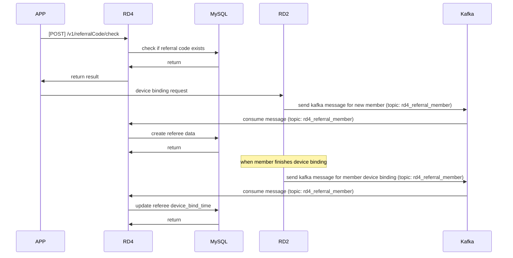
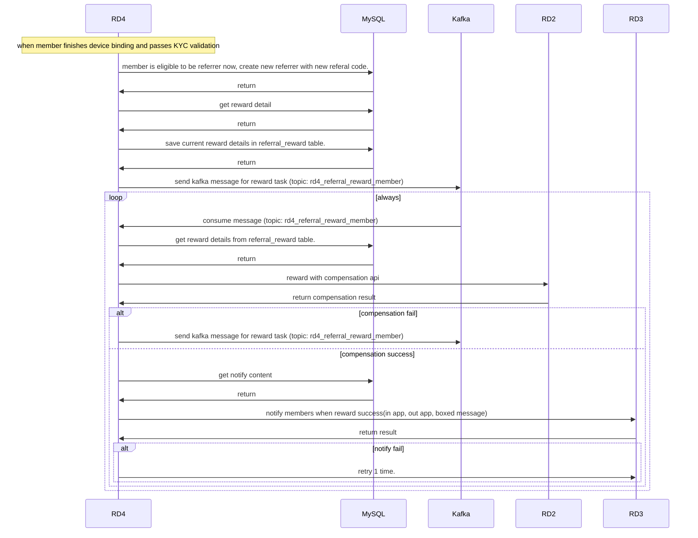

```mermaid
sequenceDiagram

APP->>RD4: [POST] /v1/referralCode/check
RD4->>MySQL : check if referral code exists
MySQL->>RD4 : return
RD4->>APP : return result
APP->>RD2: KYC validation request
RD2->>Kafka : send kafka message for new member (topic: rd4_referral_member)
Kafka->>RD4 : consume message (topic: rd4_referral_member)
RD4->>MySQL : create referee data
MySQL->>RD4 : return
Note over RD2: when member pass KYC
RD2->>Kafka : send kafka message for member passing KYC (topic: rd4_referral_member)
Kafka->>RD4 : consume message (topic: rd4_referral_member)
RD4->>MySQL : update referee kyc_pass_time
MySQL->>RD4 : return

```

```mermaid
sequenceDiagram

APP->>RD4: [POST] /v1/referralCode/check
RD4->>MySQL : check if referral code exists
MySQL->>RD4 : return
RD4->>APP : return result
APP->>RD2: device binding request
RD2->>Kafka : send kafka message for new member (topic: rd4_referral_member)
Kafka->>RD4 : consume message (topic: rd4_referral_member)
RD4->>MySQL : create referee data
MySQL->>RD4 : return
Note over RD2: when member finishes device binding
RD2->>Kafka : send kafka message for member device binding (topic: rd4_referral_member)
Kafka->>RD4 : consume message (topic: rd4_referral_member)
RD4->>MySQL : update referee device_bind_time
MySQL->>RD4 : return

```

```mermaid
sequenceDiagram

Note over RD4 : when member finishes device binding and passes KYC validation
RD4->>MySQL : member is eligible to be referrer now, create new referrer with new referal code.
MySQL->>RD4 : return
RD4->>MySQL : get reward detail
MySQL->>RD4 : return
RD4->>MySQL : save current reward details in referral_reward table.
MySQL->>RD4 : return
RD4->>Kafka : send kafka message for reward task (topic: rd4_referral_reward_member)
loop always
    Kafka->>RD4 : consume message (topic: rd4_referral_reward_member)
    RD4->>MySQL : get reward details from referral_reward table.
    MySQL->>RD4 : return
    RD4->>RD2 : reward with compensation api
    RD2->>RD4 : return compensation result
    alt compensation fail
        RD4->>Kafka : send kafka message for reward task (topic: rd4_referral_reward_member)
        else compensation success
            RD4->>MySQL : get notify content
            MySQL->>RD4 : return
            RD4->>RD3 : notify members when reward success(in app, out app, boxed message)
            RD3->>RD4 : return result
            alt notify fail
                RD4->>RD3 : retry 1 time.
        end
    end
end


```